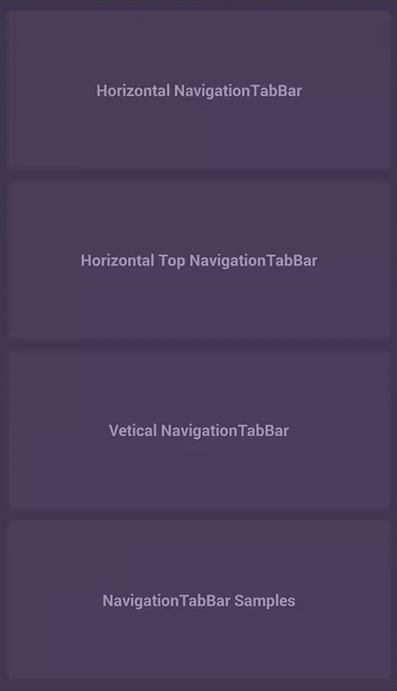
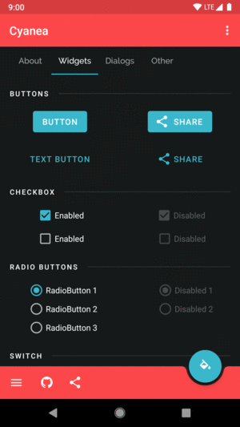

## Stack
### Navigation Tab Bar
:star: :star: :star:

[link](https://github.com/Devlight/NavigationTabBar)

Star: 4387

### ViewPager

#### Choice 1
:star: :star: :star:

[link](https://github.com/florent37/MaterialViewPager)

#### Choice 2
[link](https://github.com/kmshack/Android-ParallaxHeaderViewPager)

### Sheet

[link](https://github.com/zzz40500/AndroidSweetSheet)

### Edit Text

[link](https://github.com/bufferapp/BufferTextInputLayout)

### About Page

[link](https://github.com/medyo/android-about-page)

### Drawer

#### Choice 1

[link](https://github.com/yarolegovich/SlidingRootNav)

:star: :star: :star:

#### Choice 2

[link](https://github.com/mikepenz/MaterialDrawer)

### Ticker

[link](https://github.com/robinhood/ticker)

### Adapter

:star: :star: :star:

[link](https://github.com/CymChad/BaseRecyclerViewAdapterHelper)

Powerful and flexible RecyclerView Adapter

### Alter

[link](https://github.com/Tapadoo/Alerter)

### Social SDK

[link](https://github.com/chendongMarch/SocialSdkLibrary)

使用 微博、QQ、微信、钉钉 原生 SDK 接入，提供这些平台的登录、分享功能支持。

### APP intro

[link](https://github.com/paolorotolo/AppIntro)

### Folding Cell

[link](https://github.com/Ramotion/folding-cell-android)

### Guide

[link](https://github.com/KeepSafe/TapTargetView)

### Intro Screen

[link](https://github.com/TangoAgency/material-intro-screen)

### Lock Screen

[link](https://github.com/aritraroy/PatternLockView)

### Dialog

[link](https://github.com/javiersantos/MaterialStyledDialogs)

### Debug

[link](https://github.com/material-foundation/material-remixer-android)

Remixer is a framework to iterate quickly on UI changes by allowing you to adjust UI variables without needing to rebuild (or even restart) your app. You can adjust Numbers, Colors, Booleans, and Strings.

### Theme

[link](https://github.com/jaredrummler/Cyanea)

A powerful, dynamic, and fun theme engine. Named after Octopus Cyanea which is adept at camouflage and not only can change color frequently, but also can change the patterns on and texture of its skin.

### RxTool
[link](https://github.com/vondear/RxTool)

Android开发过程经常需要用到各式各样的工具类，虽然大部分只需谷歌/百度一下就能找到。
但是有时候急需使用却苦苦搜寻不到，于是整理了自己平常用到的工具类，以便以后的使用。

### Icon

[link](https://github.com/JoanZapata/android-iconify)

### Drop Down Menu

[link](https://github.com/dongjunkun/DropDownMenu)

