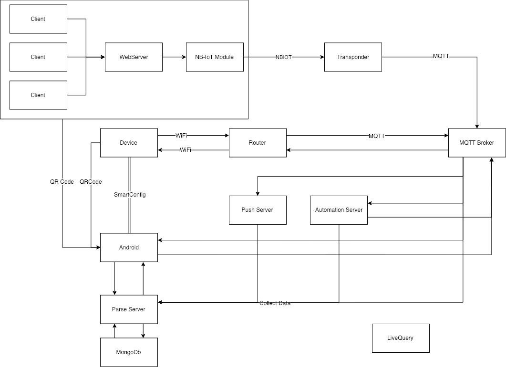
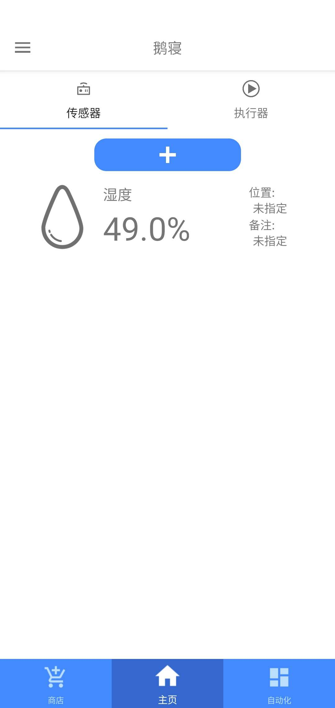
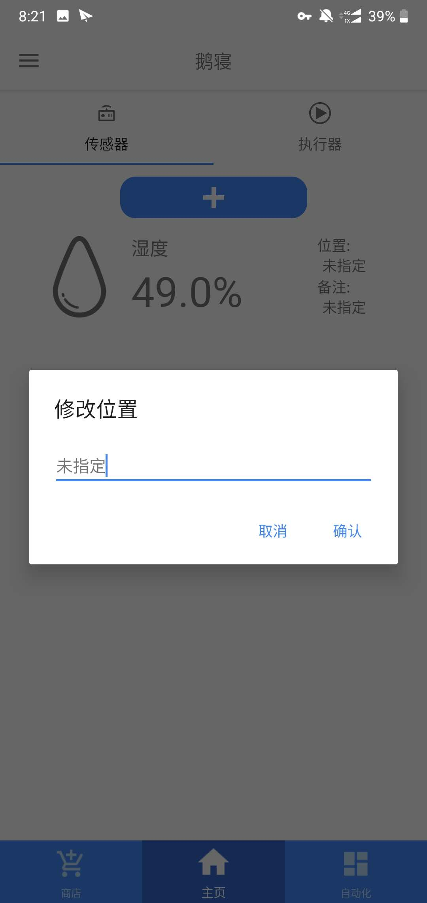
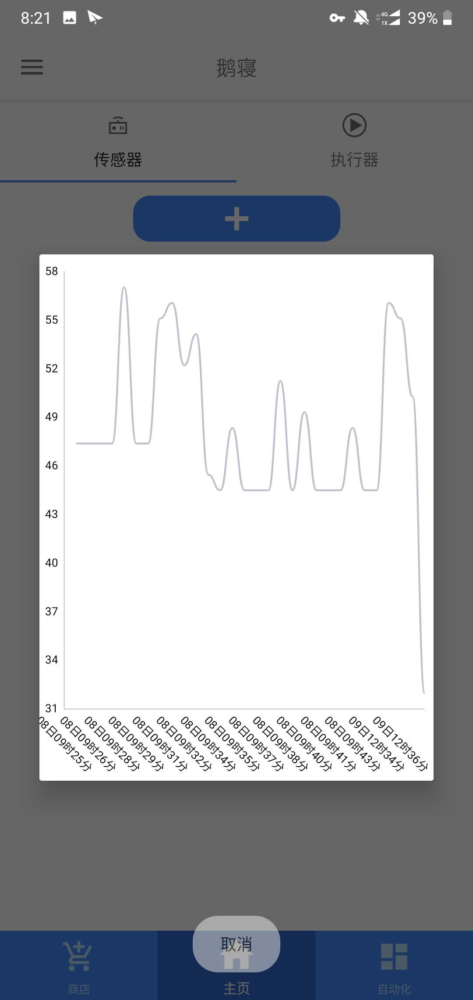
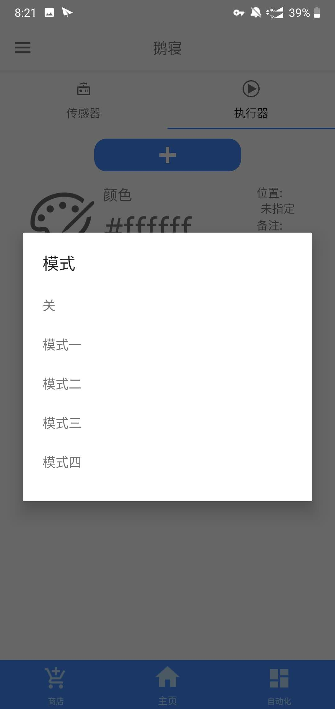
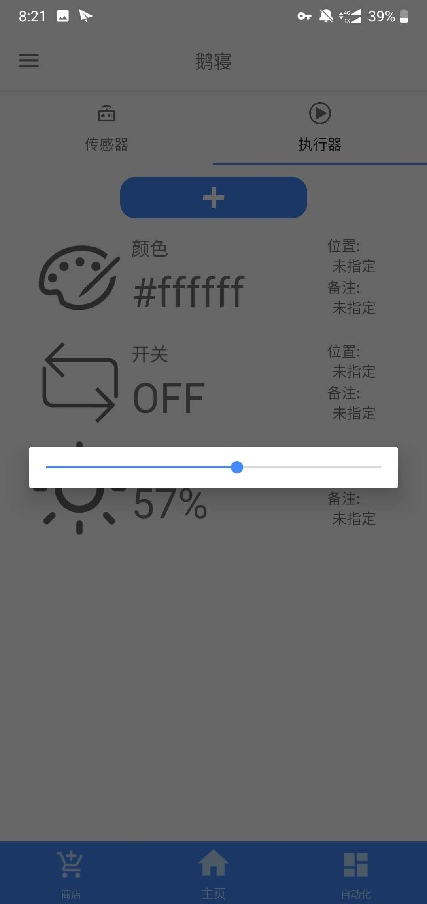
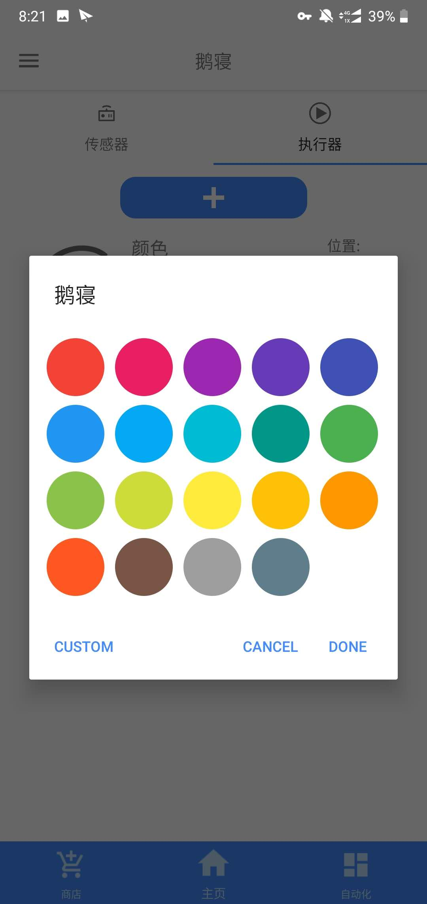
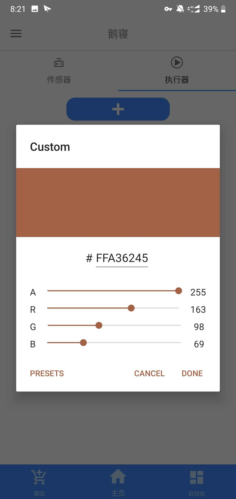
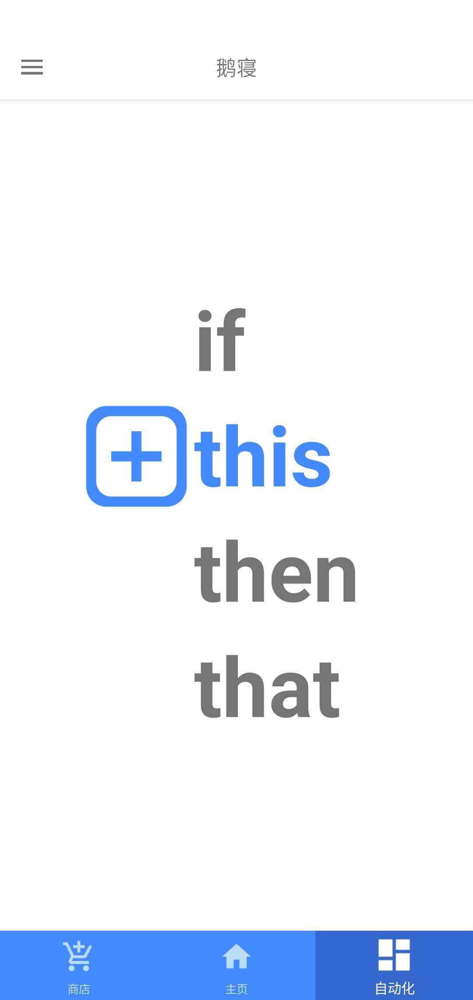

# 概览

使用MQTT协议构建一个物联网应用. 在Android可以查看传感器数据, 对底层控制器发布控制信息, 并将接收到的传感器保存进入数据库以便在Android进行图形化显示.

[视频预览](https://www.bilibili.com/video/BV1jt411t79w)

## 整体架构



1. NB-IoT部分

 使用一个NodeMCU开启AP(接入点)模式, 开放设备接入,并开启WebServer监听请求, 多个设备通过WiFi连接AP, 同时客户端通过HTTP的POST请求, 向WebServer提交其传感器数据. WebServer收集来自客户端的数据, 将数据打包通过软串口的方式发送到NB-IoT模块. NB-IoT将数据传输至透穿云. 为了方便对数据的统一操作, 使用一个转发器, 将透穿云的数据转发到MQTT Broker.

2. WiFi部分

 Android通过扫描设备唯一指定二维码, 把设备信息添加进入Parse(Android数据控制后台), 从而生成一个唯一确定的Topic. 之后Android根据二维码信息判断设备类型是否需要执行SmartConfig(智能配网), 如果需要则打开SmartConfig页面, 根据用户所在WiFi网络并由用户给定WiFi密码, 将WiFi信息广播到设备, 从而使设备上线. 

## 硬件

1. WiFi设备

使用集成ESP模块的NodeMCU作为主控器. NodeMCU为一个WiFi+MCU模块, 提供了高效便捷的入网方式.  

2. NB-IoT设备

使用NodeMCU作为主控器. 因采用NB-IoT通信, 故采用NB-75作为通信模块, 为NodeMCU提供入网能力. 

## 智能配网 - SmartConfig

在WiFi设备配网的过程中, 采用SmartConfig为设备配置WiFi账号密码信息, 为设备配网.

大体流程如下:

1. 设备在启动时, 打开AP模式. 同时开启混杂模式, 监听所有数据报.
2. Android接入可联网的WiFi网络.
3. Android开启配网模式, 广播发送含有WiFi信息的数据报.
4. 设备在监听过程中收到带有标识的WiFi信息, 解析信息提取WiFi账号密码.
5. 设备根据提取的WiFi账号密码为设备配网, 链接互联网.

## 添加设备

Android设备可以通过扫码添加设备, 其中二维码信息通过base64加码. 每个设备唯一指定一个二维码, 并且原始信息包括连接方式/ID/设备类型/标识信息

例如:

湿度传感器, 携带唯一标识/链接方式/传感器或执行器/数据含义/设备标识

原始信息: 

> bing-wifi-sensor-humidity-1

经过base64:

> YmluZy13aWZpLXNlbnNvci1odW1pZGl0eS0x

将字符串转化成二维码:


## 数据存储

用户数据存储主要采用Parse Server + Mongodb实现

传感器数据采用LiveQuery监听设备表, 当设备表有更新/删除等操作时, 重启MQTT客户端(此过程在服务器完成, 无需打开Android客户端), 订阅当前所有的Topic, 将收到的数据全部保存进入Parse后端.从而实现传感器数据的收集.

## 数据展示

数据展示主要分为两种, 第一种为概览信息, 仅显示当前传感器数值. 第二种为历史信息, 显示存入后台最近的30条信息. 详细如下:

1.简略信息 例如, 温湿度传感器仅显示其湿度/位置/备注及其图标.



      并且位置与备注可由用户指定



2. 历史信息

当用户点击具体的传感器时, 弹出历史信息



## 底层控制

由于底层设备的多样性, 导致控制信息的不统一, 由于采用动态添加的方式(RecyclerView展示), 做不到很强的兼容性, 故大体上将控制信息分为三类开关量/模拟量/打包数据(应该不完备). 相同的布局, 点击后不同对话框来完成不同的控制下发.

1. 开关量

    开关量主要见于模式切换, 更普适的为开关. 采用List的方式进行选择. 如果被控设备为灯的话,可以选择模式.   

    

2. 模拟量

    模拟量为大多数连续变化设备的控制, 例如:亮度/音量等, 通过SeekBar实现

    

3. 打包数据(以颜色为例)

    仅有开关量与模拟量并不完备, 及时可以分别控制, 但带来很大的不便利. 所以又采用了打包数据. 颜色由RGB三个数值组成, 缺一不可. 可通过预设色板选取颜色.



   也可以通过自定义, 由用户指定特定的颜色



## 传感控制

仅仅实现简单的数据收集与数据下发, 是远远不够的, 应该要稍微带一点"智能"的味道. 所以大致实现了根据数据进行一些简单操作. 主要为两种信息通知/自动化控制.

1.信息通知

用户可以指定在某传递触发何种条件时通知到Android设备.  例如:在温度低于20°C时提醒我.


2.自动化控制

  用户可以指定在传感器触发何种条件时, 执行某种操作. 例如: 在温度低于20°C时打开空调.



# 具体实现

设备数据交互的大体示例

## 数据获取(底层至Android)

1. C++

    底层采用Arduino编写. 使用PubSubClient库实现.

    ``` c++
    void publishData(float temperature, float humidity, float heatIndex) {
      StaticJsonBuffer<200> jsonBuffer;
      JsonObject& root = jsonBuffer.createObject();
      root["temperature"] = (String)temperature;
      root["humidity"] = (String)humidity;
      root["heatIndex"] = (String)heatIndex;
      root.prettyPrintTo(Serial);
      char data[200];
      root.printTo(data, root.measureLength() + 1);
      client.publish("wifi/humidity/1", data, true);
      client.publish("wifi/temperature/1", data, true);
    }
    ```

2. Java

上位采用Java(Android). 使用eclipse.paho的MQTT SDK实现. 采用EventBus对消息队列进行处理.

```java
@Subscribe
    public void onEvent(MQTTDataItem message) {
        try {
            String topic = message.getTopic();
            String[] parts = topic.split("/");
            String connectionType = parts[0];
            String type = parts[1];
            String id = parts[2];
            if(!type.equals("humidity") && !type.equals("temperature"))
                return;
            int pos = positionTopicMapping.get(topic);
            String data = "";

            JSONObject jsonObject = new JSONObject(message.getData().toString());
            if(type.equals("temperature")){
                data = jsonObject.getDouble("temperature")+"°C";
            }else if(type.equals("humidity")){
                data = jsonObject.getDouble("humidity")+"%";
            }
            sensorItems.get(pos).setData(data);
            handler.post(udpUIRunnable);
        } catch (JSONException e) {
            e.printStackTrace();
        }
    }
```

## 数据下发(Android至底层)

1. C++

    在底层收到所订阅Topic的数据后会产生中断信息号, 调用callback函数. 在函数内部将char链接为一个字符串. 由于上次采用JSON数据结构. 使用ArduinoJson库对数据进行解析. 考虑到用户可能分别控制, 故先检校数据再获取数据.

    ```c++
    void callback(char* p_topic, byte* p_payload, unsigned int p_length) {
    
      String payload;
    
      for (uint8_t i = 0; i < p_length; i++) {
        payload.concat((char)p_payload[i]);
      }
    
      StaticJsonBuffer<200> jsonBuffer;
    
      JsonObject& mBuffer = jsonBuffer.parseObject(payload);
      if(mBuffer.containsKey("m")){
        const char* mc = mBuffer["m"];
         m = atoi(mc);
      }
      if(mBuffer.containsKey("r")){
        const char* rc = mBuffer["r"];
         r = atoi(rc);
      }
      if(mBuffer.containsKey("g")){
        const char* gc = mBuffer["g"];
        g = atoi(gc);
      }
      if(mBuffer.containsKey("b")){
        const char* bc = mBuffer["b"];
        b = atoi(bc);
      }
      if(mBuffer.containsKey("d")){
        const char* dc = mBuffer["d"];
        d = atoi(dc);
      }
      if(mBuffer.containsKey("br")){
        const char* brc = mBuffer["br"];
         br = atoi(brc);
      }
    }
    ```

2. Java

    由于Java有封装好的API, 数据下发较为简单.
    ``` java
    public boolean publish(String topicName, int qos, byte[] payload) {
            boolean flag = false;
            if (client != null && client.isConnected()) {
                MqttMessage message = new MqttMessage(payload);
                            message.setQos(qos);
                try {
                    client.publish(topicName, message);
                    flag = true;
                } catch (MqttException e) {
                                    Log.d(TAG, e.getMessage());
                }
            }
            return flag;
        }
    ```
